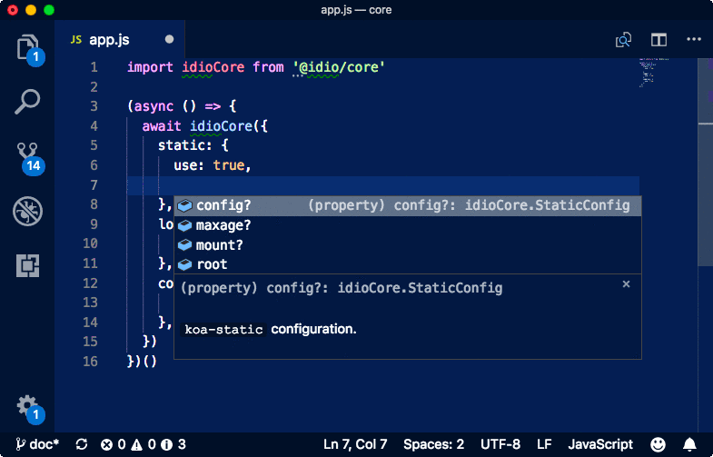

@idio/core
===

[](https://npmjs.org/package/@idio/core)

<a href="https://github.com/idio/core"></a>

`@idio/core` is a _Koa2_-based web server with some pre-installed middleware which facilitates quick creation of a web server with the essential functionality, such as serving static files, compression, body parsing, _etc_. It also provides full JSDoc documentation of all options for completion in IDEs. Other components such as `@idio/database`, `@idio/route` and `@idio/jsx` allow to build more complex websites (to come).

```sh
yarn add -E @idio/core
```

<p align="center">
<a href="https://idio.cc"></a>
</p>

<p align="center"><a href="#table-of-contents"></a></p>

## Table Of Contents

- [Table Of Contents](#table-of-contents)
- [API](#api)
- [`async core(middlewareConfig?: MiddlewareConfig, config?: Config): IdioCore`](#async-coremiddlewareconfig-middlewareconfigconfig-config-idiocore)
  * [`MiddlewareConfig`](#type-middlewareconfig)
  * [`Config`](#type-config)
  * [`IdioCore`](#type-idiocore)
- [Middleware Configuration](#middleware-configuration)
  * [Session](#session)
  * [File Uploads](#file-uploads)
  * [Cross-Site Request Forgery](#cross-site-request-forgery)
  * [Parse Body](#parse-body)
  * [Checking Auth](#checking-auth)
  * [Logging](#logging)
  * [Compression](#compression)
  * [Static Files](#static-files)
  * [CORS](#cors)
- [Custom Middleware](#custom-middleware)
- [Router Set-up](#router-set-up)
- [Copyright](#copyright)

<p align="center"><a href="#table-of-contents"></a></p>

## API

The package is available by importing its default function:

```js
import idioCore from '@idio/core'
```

<p align="center"><a href="#table-of-contents"></a></p>

## `async core(`<br/>&nbsp;&nbsp;`middlewareConfig?: MiddlewareConfig,`<br/>&nbsp;&nbsp;`config?: Config,`<br/>`): IdioCore`

The `@idio/core` accepts 2 arguments which are the middleware configuration object and server configuration object. It is possible to start the server without any configuration, however it will do nothing, therefore it is important to add some middleware configuration.

__<a name="type-middlewareconfig">`MiddlewareConfig`</a>__: Middleware configuration for the `idio` `core` server.

|    Name    |                      Type                      |      Description      |
| ---------- | ---------------------------------------------- | --------------------- |
| session    | _[SessionOptions](#type-sessionoptions)_       | `session` options.    |
| multer     | _[MulterOptions](#type-multeroptions)_         | `multer` options.     |
| csrf       | _[CSRFOptions](#type-csrfoptions)_             | `csrf` options.       |
| bodyparser | _[BodyparserOptions](#type-bodyparseroptions)_ | `bodyparser` options. |
| compress   | _[CompressOptions](#type-compressoptions)_     | `compress` options.   |
| checkauth  | _[CheckauthOptions](#type-checkauthoptions)_   | `checkauth` options.  |
| logger     | _[LoggerOptions](#type-loggeroptions)_         | `logger` options.     |
| static     | _[StaticOptions](#type-staticoptions)_         | `static` options.     |
| cors       | _[CorsOptions](#type-corsoptions)_             | `cors` options.       |

__<a name="type-config">`Config`</a>__: Server configuration object.

| Name |   Type   |              Description               |  Default  |
| ---- | -------- | -------------------------------------- | --------- |
| port | _number_ | The port on which to start the server. | `5000`    |
| host | _string_ | The host on which to listen.           | `0.0.0.0` |

---

The return type contains the _URL_, _Application_ and _Router_ instances, and the map of configured middleware, which could then be [passed to the router](#router-set-up).

[`import('koa').Application`](https://github.com/koajs/koa/blob/master/docs/api/index.md#application) __<a name="type-application">`Application`</a>__: An instance of the Koa application.

[`import('koa').Middleware`](https://medium.com/netscape/mastering-koa-middleware-f0af6d327a69) __<a name="type-middleware">`Middleware`</a>__: An async middleware function.

[`import('koa-router').Router`](https://github.com/alexmingoia/koa-router#exp_module_koa-router--Router) __<a name="type-router">`Router`</a>__: An instance of the Koa router.

[`import('http').Server`](https://nodejs.org/api/http.html#http_class_http_server) __<a name="type-server">`Server`</a>__: An instance of the Node's Server class.

__<a name="type-idiocore">`IdioCore`</a>__: An object containing the url and references to the app, router and middleware.

|    Name    |                          Type                           |                                             Description                                              |         Default         |
| ---------- | ------------------------------------------------------- | ---------------------------------------------------------------------------------------------------- | ----------------------- |
| url        | _string_                                                | The url on which the server is accessible.                                                           | `http://localhost:5000` |
| app        | _[Application](#type-application)_                      | The `Koa` application.                                                                               | -                       |
| router     | _[Router](#type-router)_                                | The `koa-router` instance.                                                                           | -                       |
| server     | _[Server](#type-server)_                                | The `http` server instance.                                                                          | -                       |
| middleware | _Object.&lt;string, [Middleware](#type-middleware)&gt;_ | The map of configured middleware functions which could then be set up to be used on a certain route. | -                       |

---

To start the server, the async method needs to be called and passed the middleware and server configuration objects. For example, the following code will start a server which serves static files with enabled compression.

```js
import idioCore from '@idio/core'

const Server = async () => {
  const { url } = await idioCore({
    logger: {
      use: true,
    },
    static: {
      use: true,
      root: 'example/static',
      mount: '/static',
    },
    compress: {
      use: true,
      config: {
        threshold: 1024,
      },
    },
  }, {
    port: 8080,
  })
  console.log('File available at: %s/static/test.txt', url)
}
```
```
File available at: http://localhost:8080/static/test.txt
```

<p align="center"><a href="#table-of-contents"></a></p>

## Middleware Configuration

The middleware can be configured according to the `MiddlewareConfig`. `@idio/core` comes with some installed middleware as dependencies to speed up the process of creating a web server. Moreover, any custom middleware which is not part of the bundle can also be specified here (see [Custom Middleware](#custom-middleware)).

Each middleware accepts the following properties:

|  Property  |                                                                                                                             Description                                                                                                                             | Default |
| ---------- | ------------------------------------------------------------------------------------------------------------------------------------------------------------------------------------------------------------------------------------------------------------------- | ------- |
| `use` | Whether to use this middleware for every request. If not set to `true`, the configured middleware function will be included in the `middleware` property of the returned object, which can then be passed to a router configuration (not part of the `@idio/core`). | `false` |
| `config` | Configuration object expected by the middleware constructor.                                                                                                                                                                                                        | `{}` |
| `...props` | Any additional specific properties (see individual middleware configuration).                                                                                                                                                                                       |         |


<p align="center"><a href="#table-of-contents"></a></p>
<a href="https://github.com/koajs/session"></a>
<details>
<summary><strong><a name="session">Session</a></strong>: handling sessions via cookies.
<hr/>

__<a name="type-sessionoptions">`SessionOptions`</a>__

|   Name    |                  Type                  |                 Description                  | Default |
| --------- | -------------------------------------- | -------------------------------------------- | ------- |
| __keys*__ | _string[]_                             | A set of keys to be installed in `app.keys`. | -       |
| use       | _boolean_                              | Use this middleware for every request.       | `false` |
| config    | _[SessionConfig](#type-sessionconfig)_ | `koa-session` configuration.                 | -       |
</summary>

__<a name="type-sessionconfig">`SessionConfig`</a>__: Configuration passed to `koa-session`.

|   Name    |        Type         |                                                                                        Description                                                                                        |  Default   |
| --------- | ------------------- | ----------------------------------------------------------------------------------------------------------------------------------------------------------------------------------------- | ---------- |
| key       | _string_            | Cookie key.                                                                                                                                                                               | `koa:sess` |
| maxAge    | _number\|'session'_ | maxAge in ms with default of 1 day. `session` will result in a cookie that expires when session/browser is closed. Warning: If a session cookie is stolen, this cookie will never expire. | `86400000` |
| overwrite | _boolean_           | Can overwrite or not.                                                                                                                                                                     | `true`     |
| httpOnly  | _boolean_           | httpOnly or not.                                                                                                                                                                          | `true`     |
| signed    | _boolean_           | Signed or not.                                                                                                                                                                            | `true`     |
| rolling   | _boolean_           | Force a session identifier cookie to be set on every response. The expiration is reset to the original maxAge, resetting the expiration countdown.                                        | `false`    |
| renew     | _boolean_           | Renew session when session is nearly expired, so we can always keep user logged in.                                                                                                       | `false`    |


</details>

<p align="center"><a href="#table-of-contents"></a></p>
<a href="https://github.com/koa-modules/multer"></a>
<details>
<summary><strong><a name="file-uploads">File Uploads</a></strong>: receiving files on the server.
<hr/>

__<a name="type-multeroptions">`MulterOptions`</a>__

|  Name  |                 Type                 |              Description               | Default |
| ------ | ------------------------------------ | -------------------------------------- | ------- |
| use    | _boolean_                            | Use this middleware for every request. | `false` |
| config | _[MulterConfig](#type-multerconfig)_ | `koa-multer` configuration.            | -       |
</summary>

[`import('http').IncomingMessage`](https://nodejs.org/api/http.html#http_class_http_incomingmessage) __<a name="type-incomingmessage">`IncomingMessage`</a>__

[`import('fs').Stats`](https://nodejs.org/api/fs.html#fs_class_fs_stats) __<a name="type-stats">`Stats`</a>__

[`import('koa-multer').StorageEngine`](https://github.com/expressjs/multer#storage) __<a name="type-storageengine">`StorageEngine`</a>__

[`import('koa-multer').File`](https://github.com/expressjs/multer#file-information.) __<a name="type-file">`File`</a>__

__<a name="type-limits">`Limits`</a>__: [An object](https://github.com/expressjs/multer#limits) specifying the size limits.

|     Name      |   Type   |                                Description                                |  Default   |
| ------------- | -------- | ------------------------------------------------------------------------- | ---------- |
| fieldNameSize | _number_ | Max field name size in bytes.                                             | `100`      |
| fieldSize     | _number_ | Max field value size in bytes.                                            | `1024`     |
| fields        | _number_ | Max number of non-file fields.                                            | `Infinity` |
| fileSize      | _number_ | For multipart forms, the max file size in bytes.                          | `Infinity` |
| files         | _number_ | For multipart forms, the max number of file fields.                       | `Infinity` |
| parts         | _number_ | For multipart forms, the max number of parts (fields + files).            | `Infinity` |
| headerPairs   | _number_ | For multipart forms, the max number of header key=> value pairs to parse. | `2000`     |

__<a name="type-multerconfig">`MulterConfig`</a>__

|     Name     |                                                  Type                                                  |                                           Description                                           | Default |
| ------------ | ------------------------------------------------------------------------------------------------------ | ----------------------------------------------------------------------------------------------- | ------- |
| dest         | _string_                                                                                               | Where to store the files.                                                                       | -       |
| storage      | _[StorageEngine](#type-storageengine)_                                                                 | Where to store the files.                                                                       | -       |
| fileFilter   | _(req: IncomingMessage, file: File, callback: (error: Error \| null, acceptFile: boolean)) =&gt; void_ | [Function](https://github.com/expressjs/multer#filefilter) to control which files are accepted. | -       |
| limits       | _[Limits](#type-limits)_                                                                               | Limits of the uploaded data.                                                                    | -       |
| preservePath | _boolean_                                                                                              | Keep the full path of files instead of just the base name.                                      | `false` |


</details>

<p align="center"><a href="#table-of-contents"></a></p>
<a href="https://github.com/koajs/csrf"></a>
<details>
<summary><strong><a name="cross-site-request-forgery">Cross-Site Request Forgery</a></strong>: prevention against CSRF attacks.
<hr/>

__<a name="type-csrfoptions">`CSRFOptions`</a>__

|  Name  |               Type               |              Description               | Default |
| ------ | -------------------------------- | -------------------------------------- | ------- |
| use    | _boolean_                        | Use this middleware for every request. | `false` |
| config | _[CSRFConfig](#type-csrfconfig)_ | `koa-csrf` configuration.              | -       |
</summary>

__<a name="type-csrfconfig">`CSRFConfig`</a>__

|              Name              |    Type    | Description |
| ------------------------------ | ---------- | ----------- |
| invalidSessionSecretMessage    | _string_   |             |
| invalidSessionSecretStatusCode | _number_   |             |
| invalidTokenMessage            | _string_   |             |
| invalidTokenStatusCode         | _number_   |             |
| excludedMethods                | _string[]_ |             |
| disableQuery                   | _boolean_  |             |


</details>

<p align="center"><a href="#table-of-contents"></a></p>
<a href="https://github.com/koajs/body-parser"></a>
<details>
<summary><strong><a name="parse-body">Parse Body</a></strong>: parsing of data sent with requests.
<hr/>

__<a name="type-bodyparseroptions">`BodyparserOptions`</a>__

|  Name  |                     Type                     |              Description               | Default |
| ------ | -------------------------------------------- | -------------------------------------- | ------- |
| use    | _boolean_                                    | Use this middleware for every request. | `false` |
| config | _[BodyparserConfig](#type-bodyparserconfig)_ | `koa-bodyparser` configuration.        | -       |
</summary>

[`import('koa').Context`](https://github.com/koajs/koa/blob/master/docs/api/context.md) __<a name="type-context">`Context`</a>__

__<a name="type-bodyparserconfig">`BodyparserConfig`</a>__

|    Name     |                        Type                        |                                                 Description                                                  |      Default       |
| ----------- | -------------------------------------------------- | ------------------------------------------------------------------------------------------------------------ | ------------------ |
| enableTypes | _string[]_                                         | Parser will only parse when request type hits enableTypes.                                                   | `['json', 'form']` |
| encode      | _string_                                           | Requested encoding.                                                                                          | `utf-8`            |
| formLimit   | _string_                                           | Limit of the urlencoded body. If the body ends up being larger than this limit a 413 error code is returned. | `56kb`             |
| jsonLimit   | _string_                                           | Limit of the json body.                                                                                      | `1mb`              |
| strict      | _boolean_                                          | When set to true, JSON parser will only accept arrays and objects.                                           | `true`             |
| detectJSON  | _(ctx: Context) =&gt; boolean_                     | Custom json request detect function.                                                                         | `null`             |
| extendTypes | _{json: string[], form: string[], text: string[]}_ | Support extend types.                                                                                        | -                  |
| onerror     | _(err: Error, ctx: Context) =&gt; void_            | Support custom error handle.                                                                                 | -                  |


</details>

<p align="center"><a href="#table-of-contents"></a></p>
<a href="#"></a>
<details>
<summary><strong><a name="checking-auth">Checking Auth</a></strong>: a simple function which throws if <code>ctx.session.user</code> is not set. Non-configurable.
<hr/>

__<a name="type-checkauthoptions">`CheckauthOptions`</a>__

| Name |   Type    |              Description               | Default |
| ---- | --------- | -------------------------------------- | ------- |
| use  | _boolean_ | Use this middleware for every request. | `false` |
</summary>


</details>

<p align="center"><a href="#table-of-contents"></a></p>
<a href="https://github.com/koajs/logger"></a>
<details>
<summary><strong><a name="logging">Logging</a></strong>: a logger of incoming requests / response times and sizes.
<hr/>

__<a name="type-loggeroptions">`LoggerOptions`</a>__

|  Name  |                 Type                 |              Description               | Default |
| ------ | ------------------------------------ | -------------------------------------- | ------- |
| use    | _boolean_                            | Use this middleware for every request. | `false` |
| config | _[LoggerConfig](#type-loggerconfig)_ | `koa-logger` configuration.            | -       |
</summary>

__<a name="type-loggerconfig">`LoggerConfig`</a>__

|    Name     |                                            Type                                            |                                                                                       Description                                                                                       |
| ----------- | ------------------------------------------------------------------------------------------ | --------------------------------------------------------------------------------------------------------------------------------------------------------------------------------------- |
| transporter | _(str: string, args: [string, string, string, string, string, string, string]) =&gt; void_ | Param `str` is output string with ANSI Color, and you can get pure text with other modules like `strip-ansi`. Param `args` is a array by `[format, method, url, status, time, length]`. |


</details>

<p align="center"><a href="#table-of-contents"></a></p>
<a href="https://github.com/koajs/compress"></a>
<details>
<summary><strong><a name="compression">Compression</a></strong>: enabling gzip and other compression.
<hr/>

__<a name="type-compressoptions">`CompressOptions`</a>__

|  Name  |                   Type                   |              Description               | Default |
| ------ | ---------------------------------------- | -------------------------------------- | ------- |
| use    | _boolean_                                | Use this middleware for every request. | `false` |
| config | _[CompressConfig](#type-compressconfig)_ | `koa-compress` configuration.          | -       |
</summary>

__<a name="type-compressconfig">`CompressConfig`</a>__

|    Name     |                  Type                  |                                                          Description                                                          | Default |
| ----------- | -------------------------------------- | ----------------------------------------------------------------------------------------------------------------------------- | ------- |
| filter      | _(content_type: string) =&gt; boolean_ | An optional function that checks the response content type to decide whether to compress. By default, it uses `compressible`. | -       |
| threshold   | _number_                               | Minimum response size in bytes to compress.                                                                                   | `1024`  |
| flush       | _number_                               | Default: `zlib.constants.Z_NO_FLUSH`.                                                                                         | -       |
| finishFlush | _number_                               | Default: `zlib.constants.Z_FINISH`.                                                                                           | -       |
| chunkSize   | _number_                               | Default: `16*1024`.                                                                                                           | -       |
| windowBits  | _number_                               | Support extend types.                                                                                                         | -       |
| level       | _number_                               | Compression only.                                                                                                             | -       |
| memLevel    | _number_                               | Compression only.                                                                                                             | -       |
| strategy    | _number_                               | Compression only.                                                                                                             | -       |
| dictionary  | _*_                                    | Deflate/inflate only, empty dictionary by default.                                                                            | -       |


</details>

<p align="center"><a href="#table-of-contents"></a></p>
<a href="https://github.com/koajs/static"></a>
<details>
<summary><strong><a name="static-files">Static Files</a></strong>: serving files from filesystem.
<hr/>

__<a name="type-staticoptions">`StaticOptions`</a>__

|   Name    |                 Type                 |                    Description                    | Default |
| --------- | ------------------------------------ | ------------------------------------------------- | ------- |
| __root*__ | _string\|string[]_                   | Root or multiple roots from which to serve files. | -       |
| use       | _boolean_                            | Use this middleware for every request.            | `false` |
| mount     | _string_                             | Path from which to serve files.                   | `/`     |
| maxage    | _number_                             | How long to cache file for.                       | `0`     |
| config    | _[StaticConfig](#type-staticconfig)_ | `koa-static` configuration.                       | -       |
</summary>

[`import('http').ServerResponse`](https://nodejs.org/api/http.html#http_class_http_serverresponse) __<a name="type-serverresponse">`ServerResponse`</a>__

`(res: ServerResponse, path: string, stats: Stats) => any` __<a name="type-setheaders">`SetHeaders`</a>__

__<a name="type-staticconfig">`StaticConfig`</a>__

|    Name    |               Type               |                                                                                             Description                                                                                             |   Default    |
| ---------- | -------------------------------- | --------------------------------------------------------------------------------------------------------------------------------------------------------------------------------------------------- | ------------ |
| maxage     | _number_                         | Browser cache max-age in milliseconds.                                                                                                                                                              | `0`          |
| hidden     | _boolean_                        | Allow transfer of hidden files.                                                                                                                                                                     | `false`      |
| index      | _string_                         | Default file name.                                                                                                                                                                                  | `index.html` |
| defer      | _boolean_                        | If `true`, serves after return next(), allowing any downstream middleware to respond first.                                                                                                         | `false`      |
| gzip       | _boolean_                        | Try to serve the gzipped version of a file automatically when gzip is supported by a client and if the requested file with `.gz` extension exists.                                                  | `true`       |
| br         | _boolean_                        | Try to serve the brotli version of a file automatically when brotli is supported by a client and if the requested file with `.br` extension exists (note, that brotli is only accepted over https). | `true`       |
| setHeaders | _[SetHeaders](#type-setheaders)_ | Function to set custom headers on response.                                                                                                                                                         | -            |
| extensions | _boolean_                        | Try to match extensions from passed array to search for file when no extension is sufficed in URL. First found is served.                                                                           | `false`      |


For example, the below configuration will serve files from both the `static` directory of the project, and the _React.js_ dependency. When `NODE_ENV` environment variable is set to `production`, files will be cached for 10 days.

```js
import { join, dirname } from 'path'
import idioCore from '@idio/core'

const STATIC = join(__dirname, 'static')
const REACT = join(dirname(require.resolve('react')), 'umd')

const DAY = 1000 * 60 * 60 * 24

const Static = async () => {
  const { url } = await idioCore({
    static: {
      use: true,
      root: [STATIC, REACT],
      mount: '/scripts',
      maxage: process.env.NODE_ENV == 'production' ? 10 * DAY : 0,
    },
  }, { port: 5004 })
  return url
}
```
```
Static server started on http://localhost:5004
```

</details>

<p align="center"><a href="#table-of-contents"></a></p>
<a href="https://github.com/koajs/cors"></a>
<details>
<summary><strong><a name="cors">CORS</a></strong>: return Cross-Origin Resource Sharing headers.
<hr/>

`import('koa').Context` __<a name="type-context">`Context`</a>__

__<a name="type-corsoptions">`CorsOptions`</a>__

|  Name  |                           Type                            |                                                                                                                                                                                                             Description                                                                                                                                                                                                              | Default |
| ------ | --------------------------------------------------------- | ------------------------------------------------------------------------------------------------------------------------------------------------------------------------------------------------------------------------------------------------------------------------------------------------------------------------------------------------------------------------------------------------------------------------------------ | ------- |
| origin | _string\|Array&lt;string&gt;\|((ctx: Context) => string)_ | The origin or an array of origins to accept as valid. In case of an array, the origin from the request headers will be searched in the array, and if found, it will be returned (since browsers only support a single `Access-Control-Allow-Origin` header). If a function is passed, it should return the string with the origin to set. If not passed, the request origin is returned, allowing any origin to access the resource. | -       |
| use    | _boolean_                                                 | Use this middleware for every request.                                                                                                                                                                                                                                                                                                                                                                                               | `false` |
| config | _[CorsConfig](#type-corsconfig)_                          | `@koa/cors` configuration.                                                                                                                                                                                                                                                                                                                                                                                                           | -       |
</summary>

__<a name="type-corsconfig">`CorsConfig`</a>__

|        Name        |             Type              |                      Description                       |             Default              |
| ------------------ | ----------------------------- | ------------------------------------------------------ | -------------------------------- |
| origin             | _string_                      | `Access-Control-Allow-Origin` header value.            | `request Origin header`          |
| allowMethods       | _string\|Array&lt;string&gt;_ | `Access-Control-Allow-Methods` header value.           | `GET,HEAD,PUT,POST,DELETE,PATCH` |
| exposeHeaders      | _string\|Array&lt;string&gt;_ | `Access-Control-Expose-Headers` header value.          | -                                |
| allowHeaders       | _string\|Array&lt;string&gt;_ | `Access-Control-Allow-Headers` header value.           | -                                |
| maxAge             | _string\|number_              | `Access-Control-Max-Age` header value in seconds.      | -                                |
| credentials        | _boolean_                     | `Access-Control-Allow-Credentials` header value.       | `false`                          |
| keepHeadersOnError | _boolean_                     | Add set headers to `err.header` if an error is thrown. | `false`                          |


</details>

<p align="center"><a href="#table-of-contents"></a></p>

## Custom Middleware

When required to add any other middleware in the application not included in the `@idio/core` bundle, it can be done in several ways.

1. Passing the middleware function as part of the _MiddlewareConfig_. It will be automatically installed to be used by the _Application_. All middleware will be installed in order it is found in the _MiddlewareConfig_.

```js
import idioCore from '@idio/core'

/** @typedef {import('koa').Middleware} Middleware */

const APIServer = async (port) => {
  const { url } = await idioCore({
    // 1. Add logging middleware.
    /** @type {Middleware} */
    async log(ctx, next) {
      await next()
      console.log(' --> API: %s %s %s', ctx.method, ctx.url, ctx.status)
    },
    // 2. Add always used error middleware.
    /** @type {Middleware} */
    async error(ctx, next) {
      try {
        await next()
      } catch (err) {
        ctx.status = 403
        ctx.body = err.message
      }
    },
    // 3. Add validation middleware.
    /** @type {Middleware} */
    async validateKey(ctx, next) {
      if (ctx.query.key !== 'app-secret')
        throw new Error('Wrong API key.')
      ctx.body = 'ok'
      await next()
    },
  }, { port })
  return url
}

export default APIServer
```
```
Started API server at: http://localhost:5005
 --> API: GET / 403
 --> API: GET /?key=app-secret 200
```

2. Passing a configuration object as part of the _MiddlewareConfig_ that includes the `middlewareConstructor` property which will receive the reference to the `app`. Other properties such as `conf` and `use` will be used in the same way as when setting up bundled middleware: setting `use` to `true` will result in the middleware being used for every request, and the `config` will be passed to the constructor.

```js
import rqt from 'rqt'
import idioCore from '@idio/core'
import APIServer from './api-server'

const ProxyServer = async (port) => {
  // 1. Start the API server.
  const API = await APIServer(5001)
  console.log('API server started at %s', API)

  // 2. Start a proxy server to the API.
  const { url } = await idioCore({
    /** @type {import('koa').Middleware} */
    async log(ctx, next) {
      await next()
      console.log(' --> Proxy: %s %s %s', ctx.method, ctx.url, ctx.status)
    },
    api: {
      use: true,
      async middlewareConstructor(app, config) {
        // e.g., read from a virtual network
        app.context.SECRET = await Promise.resolve('app-secret')

        /** @type {import('koa').Middleware} */
        const fn = async(ctx, next) => {
          const { path } = ctx
          const res = await rqt(`${config.API}${path}?key=${ctx.SECRET}`)
          ctx.body = res
          await next()
        }
        return fn
      },
      config: {
        API,
      },
    },
  }, { port })
  return url
}
```
```
API server started at http://localhost:5001
Proxy started at http://localhost:5002
 --> API: GET /?key=app-secret 200
 --> Proxy: GET / 200
```


<p align="center"><a href="#table-of-contents"></a></p>

## Router Set-up

After the _Application_ and _Router_ instances are obtained after starting the server as the `app` and `router` properties of the [returned object](#type-idiocore), the router can be configured to respond to custom paths. This can be done by assigning configured middleware from the map and standalone middleware, and calling the `use` method on the _Application_ instance.

```js
import idioCore from '@idio/core'

async function pre(ctx, next) {
  console.log('  <-- %s %s',
    ctx.request.method,
    ctx.request.path,
  )
  await next()
}

async function post(ctx, next) {
  console.log('  --> %s %s %s',
    ctx.request.method,
    ctx.request.path,
    ctx.response.status,
  )
  await next()
}

const Server = async () => {
  const path = '/test'
  const {
    url, router, app, middleware: { bodyparser },
  } = await idioCore({
    // 1. Configure the bodyparser without using it for each request.
    bodyparser: {
      config: {
        enableTypes: ['json'],
      },
    },
  }, { port: 5003 })

  // 2. Setup router with the bodyparser and path-specific middleware.
  router.post(path,
    pre,
    bodyparser,
    async (ctx, next) => {
      ctx.body = {
        ok: true,
        request: ctx.request.body,
      }
      await next()
    },
    post,
  )
  app.use(router.routes())
  return `${url}${path}`
}
```
```
Page available at: http://localhost:5003/test
  <-- POST /test
  --> POST /test 200
```

<p align="center"><a href="#table-of-contents"></a></p>

## Copyright

Middleware icons and logo from [Deco Dingbats NF font](https://www.1001fonts.com/decodingbats1-font.html).

Middleware types descriptions by their respective authors.

<table>
  <tr>
    <th>
      <a href="https://artd.eco">
        
      </a>
    </th>
    <th>
      © <a href="https://artd.eco">Art Deco</a>
      for
      <a href="https://idio.cc">Idio</a>
      2019
    </th>
    <th>
        <a href="https://idio.cc">
          
        </a>
      </th>
    <th>
      <a href="https://www.technation.sucks" title="Tech Nation Visa">
        
      </a>
    </th>
    <th>
      <a href="https://www.technation.sucks">Tech Nation Visa Sucks</a>
    </th>
  </tr>
</table>

<p align="center"><a href="#table-of-contents"></a></p>